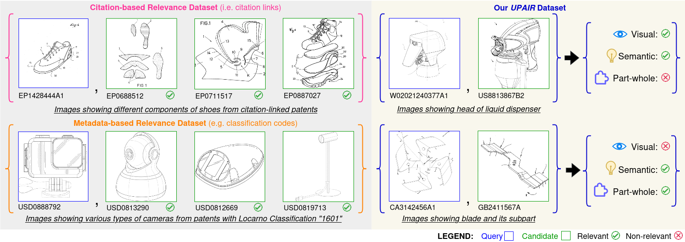

<div align="center">

# UPAIR: Utility PAtent Image Retrieval Benchmark

[](https://tibhannover.github.io/upair/)
[](https://doi.org/10.5281/zenodo.15564780)


</div>

We introduce UPAIR, a novel human-annotated benchmark for evaluating multimodal image retrieval in the context of utility patents. UPAIR addresses current limitations by providing:

1. Three-dimensional relevance annotations between patent image pairs:
    - Visual similarity — resemblance in appearance
    - Semantic similarity — functional or conceptual correspondence
    - Part-whole relationships — whether one image is a component of another
2. Large-scale image-text corpus for training vision-language models with contrastive learning.

## UPAIR Benchmark - Dataset Preparation

### Candidate Sampling Process

1. Install dependencies

```bash
$ python3 -m venv .env
$ source .env/bin/activate
$ pip3 install -r requirements.txt
```

2. Download PatentNet weights from 

3. Build indices for each metadata and each vision encoder

```bash
$ python3 src/index.py
```

4. Start sampling process

```bash
$ python3 src/main.py
```